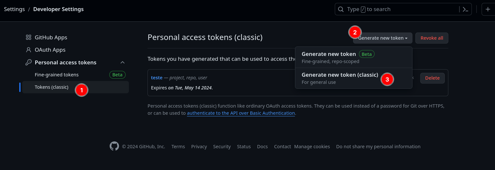

## Actions Franzininho

Este repositório contém actions para os repositórios da organização Franzininho para que a documentação desses repositórios seja gerada de forma automática.

## Tipos de actions

1. [Repositório apenas com exemplos ou exercícios](./repositorio-exemplos/README.md)
2. [Repositório de um único projeto com o README na pasta principal](./repositorio-um-projeto/README.md)

## Configurações necessárias para o uso das actions

### 1. Geração de um token de autenticação

Para gerar um token, é preciso acessar a configuração _developer settings_ no seu perfil de Usuário no Github e gerar um token:

Depois de gerar o Token, é preciso salvá-lo pois ele não será acessível posteriormente

### 2. Inserir o token como um segredo do repositório onde a action será inserida

Para isso, é preciso acessas as configurações do repositório e acessar a opção _secrets and variables_ e dentro a opção _actions_

Depois disso, é preciso criar um novo segredo com o nome **TOKEN** (esse nome é importante, pois é o nome que é referenciado dentro das actions) e atribuir a ele o valor do token gerado no passo anterior.

